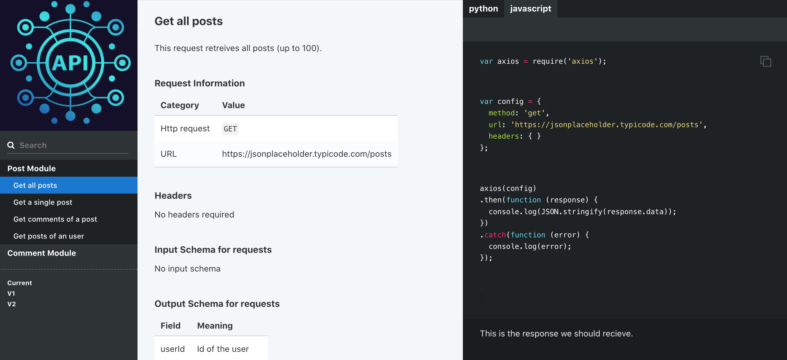

  
  <h1 align="center">Slate Demo</h1>

  

Slate helps you create beautiful, intelligent, responsive API documentation.

 <i>
    This is a demo using Slate to create API docs and using jsonplaceholder for API testing and prototyping.

  </i>
     
     
    

    <a href="https://slate-api-demo.netlify.app">See Demo Here</a>

